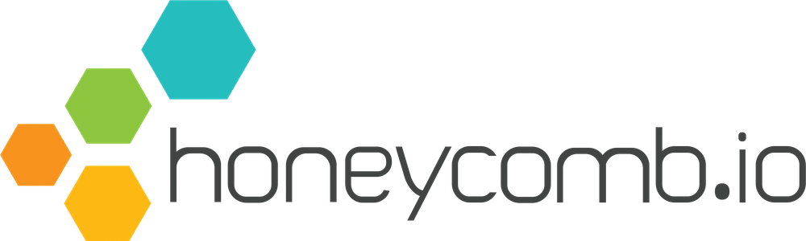
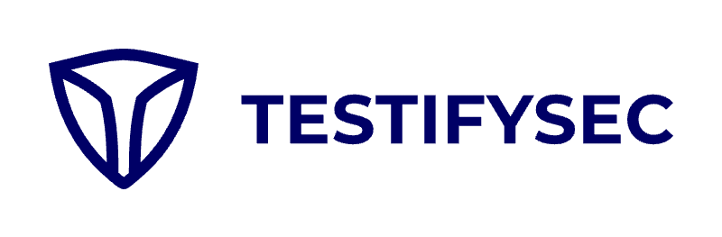

KubeCon + CloudNativeCon is coming to Paris and to celebrate the occasion, we are hosting a Karaoke party on **Wednesday March 20, 9pm - 2am** at KaraFun Bar Paris.
<iframe src="https://www.google.com/maps/embed?pb=!1m18!1m12!1m3!1d2624.345731628021!2d2.347888712625055!3d48.870685399720735!2m3!1f0!2f0!3f0!3m2!1i1024!2i768!4f13.1!3m3!1m2!1s0x47e66f2bf110a499%3A0x86ae8d7be422c7c8!2sKaraFun%20Paris!5e0!3m2!1sen!2sus!4v1708800983108!5m2!1sen!2sus" width="600" height="450" style="border:0;" allowfullscreen="" loading="lazy" referrerpolicy="no-referrer-when-downgrade"></iframe>

We will have an open bar and snacks, thanks to our generous sponsors!

**Registration**  
Due to overwhelming interest, we are now requiring folks to register.
Please fill in the registration form below to add yourself to the guest list.

Registration will collect your email, but it will only be used for sending confirmation and invites; your **personal email address** will **not** be shared with the sponsors for marketing purposes. We will share the **unique company domain names** from emails (i.e. companyname.com) with sponsors.

Beginning at 8:30pm and whenever new slots become available, we will send out QR codes to the top addresses on the guest list, which will let you enter the venue.
Once you have received your QR code, you have a limited amount of time to arrive. If you’re late and the venue is full, you can queue at the door or come back at a later time. We will fill the venue from the queue first, before sending out new QR codes.
If the venue is not full, and you have a valid QR code, you can enter even if you’re late.

We will **not admit anyone without a QR code**. Please do not bring friends who did not register. If you are in a group and want to come together, please wait until you all have a code.

REGISTRATION WILL OPEN SOON!

**Safety & Accessibility**  
By attending the event, you agree to abide by our [Code of Conduct](/coc). Please make sure you have reviewed it prior to the event.

We do *not* require mask wearing or proof of vaccination. Please be aware that the venue is small
and there will be loud singing. If you are concerned about infection risk, we would advise you to not attend.

**Sponsors**  
This event is made possible by our generous sponsors ❤️

